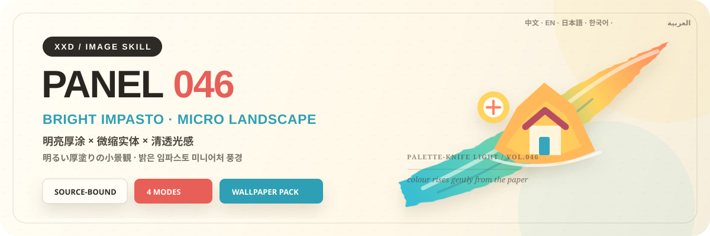
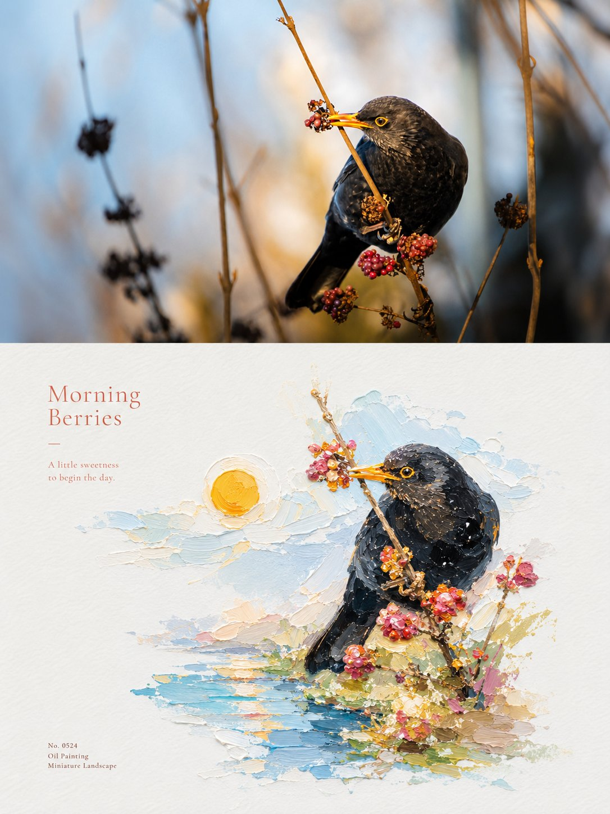
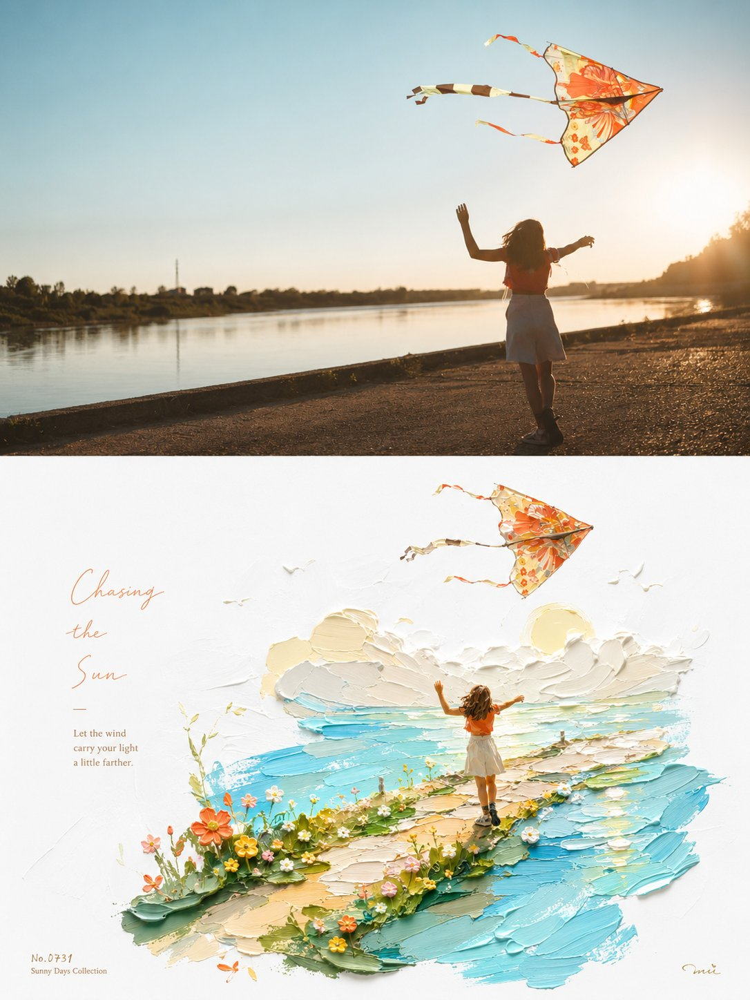
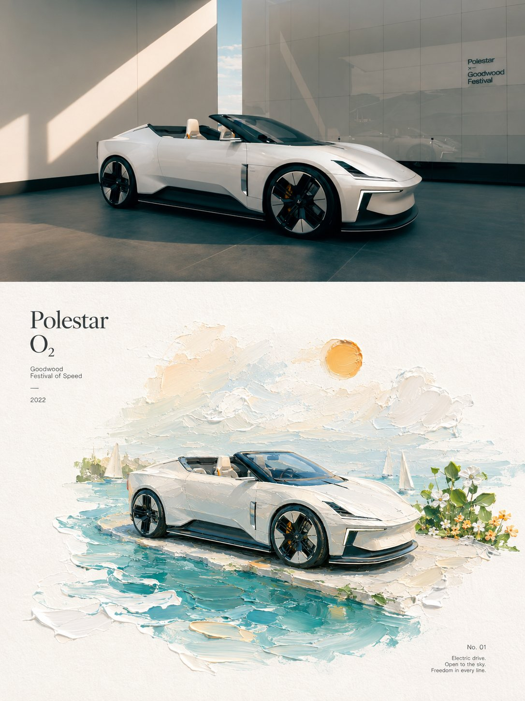
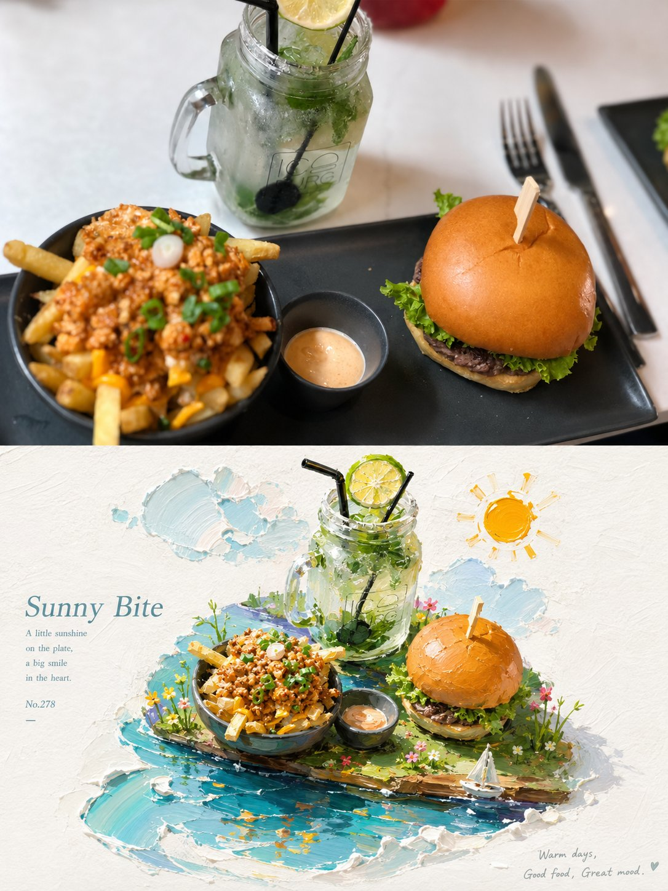

<p align="center">
  
</p>

<div align="center">

# 🦁 XXD Panel 046

### 写真を、明るく鮮やかで手で触れられそうな厚塗りの微縮風景へ

[](./SKILL.md)
[](#4つの出力を支えるひとつの厚塗りロジック)
[](#境界と信頼性)

<a href="README.md">简体中文</a> · <a href="README.en.md">English</a> · <strong>日本語</strong> · <a href="README.ko.md">한국어</a> · <a href="README.ar.md">العربية</a>

</div>

> 明るい白地 · 鮮やかな厚塗り · 微縮の実体感 · 斜めの色面 · 温かな光

XXD Panel 046 は、Codex と互換 Agent のための画像生成 Skill です。写真から識別に必要な主体の個性を残し、絵の具の厚み、ペインティングナイフの跡、微縮の尺度感を備えた油彩の微景観へ再構成します。

主体を支えるのは、元写真から導いた一本の斜めの色面です。周囲には温かみのある白い紙の余白を広く残し、色は明るく透き通り、生命感を持ちます。文字は後付けの大見出しではなく、美術出版物の繊細な注記のように扱います。

## 作例 · X より

> [小小東（@xiaoxiaodong01）](https://x.com/xiaoxiaodong01/status/2091337011403882991) · 2026年8月23日<br>
> GPT2 × 厚塗り × 浮現 × 美学プロンプト × VOL.046<br>
> 油彩の触感を持つ明るい厚塗り。色はより鮮やかに、主体は温白の紙と透明感のある斜めの色面からゆっくり浮かび上がるように現れます。

<table>
  <tr>
    <td width="50%"><a href="https://x.com/xiaoxiaodong01/status/2091337011403882991"></a></td>
    <td width="50%"><a href="https://x.com/xiaoxiaodong01/status/2091337011403882991"></a></td>
  </tr>
  <tr>
    <td width="50%"><a href="https://x.com/xiaoxiaodong01/status/2091337011403882991"></a></td>
    <td width="50%"><a href="https://x.com/xiaoxiaodong01/status/2091337011403882991"></a></td>
  </tr>
</table>

<p align="center"><a href="https://x.com/xiaoxiaodong01/status/2091337011403882991">元の投稿と完全なプロンプトを見る →</a></p>

これらの作例は 046 の美学的動機を示すためのものです。作例の被写体、色面の方向、配色、文案、旧来の画面比率を生成参照や現在の既定値として固定することはありません。

<!-- xxd-panel-benefit:start -->
## すぐに判断：XXD Panel 046 はあなたに合う？

| 知りたいこと | このスタイルの答え |
|---|---|
| **得られる完成作品** | 写真を、明るく鮮やかで手で触れられそうな厚塗りの微縮風景へ |
| **ひと目で分かる特徴** | 明るい白地 · 鮮やかな厚塗り · 微縮の実体感 · 斜めの色面 · 温かな光 |
| **入力素材をどう尊重するか** | 入力に固有の人物・物・関係・構造・事実を識別可能なまま保ちます。スタイル変換は視覚言語を再構成するもので、内容を無関係なテンプレートへ置き換えません。 |
| **利用できる形** | 上下、左右、デザインのみ、4端末の壁紙を、複数比率または正確なサイズで作れます。納品形式が変わっても、この Panel のスタイル固有性は薄まりません。 |
<!-- xxd-panel-benefit:end -->

## 入力から独自の完成作品が生まれるまで

一般的な「厚塗り風」は、写真全体に暗い油彩フィルターをかけるか、プラスチックの玩具のような主体を無関係なブラシストロークに載せるテンプレートになりがちです。

046 は順序を逆にします。

```text
主体の個性を固定 → 斜めの支持面を導く → 本物の厚塗りを集中 → 元写真の色を明るくする → 温白の呼吸空間を残す → 繊細な編集文字を添える
```

無関係な写真に替えても微縮の主体、斜めの色面、配色、光、文字がほぼ成立するなら、それは 046 ではありません。

## 完成作品で見分けやすいスタイル特性

- **識別できる微縮主体：** 元写真固有の手掛かりを最低3つ残し、角度や細部を整えても主体自体は置き換えません。
- **一本の斜めの支持面：** 水面、地面、道、光帯、風景の断片になっても、元写真から導かれ、主体を本当に支える必要があります。
- **本物の厚塗り素材：** 絵の具の盛り上がり、ナイフ痕、起伏のある端、紙肌、厚薄の対比を共存させます。
- **元写真由来の明るい配色：** 写真の鮮やかな色を明るく澄ませますが、固定のキャンディカラーは当てません。
- **広い温白の余白：** 画布を塗り尽くさず、紙、光、微縮の尺度感を呼吸させます。
- **透き通る温かな光：** 晴れやかで軽やかな生命感を持たせ、暗褐色のフィルター、ネオン光、商業スタジオ風は避けます。
- **美術出版物の文字：** 繊細で抑制され、紙にインクが吸われたような字形を、斜めの軸、主体の縁、または静かな余白に沿わせます。

## 原文プロンプトを唯一の美的基準にする

`references/046-source.md` が、このプロジェクト唯一の創作・美的基準です。Skill は原文を要約・拡張せず、共通の配色計画、美的動機、タイトル、マイクロコピーを追加しません。色、素材、構図、余白、言葉、タイポグラフィは、GPT Image 2 が原文プロンプトの規則どおりに実行します。

モードとサイズは、原文の変換美学を変えずに、旧来の 3:4 上下出力コンテナを完全に置き換えます。各成果物では選択された一つのモード契約だけを GPT Image 2 に送り、四つの候補を一つの汎用テンプレート内で解釈させません。

## 組み合わせ可能な4つの出力

`top-bottom`、`left-right`、`design-only`、`wallpaper-pack` は単独でも複数でも選べます。複数選択時も、各モードを独立したプロンプトで別々に生成します。

- `top-bottom`：現実画像を上、デザイン変換を下に置く一枚の完成キャンバス。
- `left-right`：上端から下端まで左右構造を保ち、元画像を左、デザインを右に配置します。文字もその構造内に統合し、幅は非対称でも構いません。
- `design-only`：元画像は不可視の参照に限定し、見える要素はすべて当該 Panel のデザイン変換言語に従います。
- `wallpaper-pack`：各端末用にデザイン変換のみの壁紙を独立再構成します。

境界線、中央比率、ピクセル座標は測定しません。決定論的な合成は、ユーザーが正確な分割または元写真のピクセル保持を明示した場合だけ使います。

通常サイズも複数選択できます：自動適応、元画像比率、1:1、3:4、4:3、4:5、5:4、2:3、3:2、9:16、16:9、21:9、5:7、7:5、カスタム比率／正確なピクセル。暗黙の既定サイズはありません。異なる比率は、同じ原文プロンプトから個別に再構成します。

壁紙セットは連動型または独立型。連動型は最初の一枚を基準画像とし、残りを元写真＋基準画像から各端末向けに再構成します。一枚を四サイズへ機械的に切り抜くことはありません。

各呼び出しではタスクディレクトリを一つだけ作り、最終 PNG をすべてその直下へ保存します。元画像、モード、サイズ、端末ごとのサブフォルダーは作らず、`source-01-left-right-3x2-2160x1440.png` や `source-01-wallpaper-linked-phone-1440x3200.png` のようにファイル名で識別します。

## 文字モード

生成前に次の一つを選びます。

1. **原文プロンプトに従ってモデルが文字を生成**：ユーザーは言語・地域だけを指定し、内容、量、調子、組版は GPT Image 2 が原文どおりに生成します。表示される言葉は現在の画像の内容、空気感、または暗示から生まれ、事実・資料として見える情報には、ユーザー提供・画像内で確認可能・検証済みの根拠が必要です。
2. **自分の正確な文言を使う**：一字一句そのまま渡し、書き換え・翻訳・タイトル追加をしません。組版は原文に従います。
3. **文字なし**：文字と疑似文字を厳格に禁止します。

外側の Skill はタイトルやマイクロコピーを先に書きません。出力言語は操作言語と別に確認し、人物、風景、ファイル名から推測しません。

## 完成キャンバス優先とラスター境界

画像モデルが完成画面全体の美的再構成を担当し、二連レイアウトも完成キャンバス一枚の直接生成を既定とします。`scripts/compose_panel.py` は条件付きの復旧、無劣化ピクセル調整、読み取り専用監査にだけ残し、毎回の事前計画や美的評価には使いません。

納品物はすべてPNGラスターで、呼び出しごとに `~/Desktop/xxd/` に新規タスクを作ります。設定済み画像経路は匿名化された状態だけを返し、提供元、接続先、認証情報、ヘッダー、プロンプト、応答、アカウント情報を公開しません。SVG、HTML、Canvas、図解、プログラム描画は最終作品の代替になりません。

## 宿主能力に適応する質問とインライン引数

同じ Skill が、宿主に実在する対話機能へ適応します。装飾記号をクリック可能な UI のようには見せません。

- **Claude Code に `AskUserQuestion + multiSelect: true` がある場合**：モードとサイズは本物のチェックボックス、文字方式と壁紙関係は単一選択。一般サイズは正方形・縦・横のグループに分け、選択を累積し、カスタム値は自由入力します。
- **Codex に `request_user_input` しかない場合**：文字方式や壁紙関係など、相互排他的な項目だけに使います。モードやサイズを単一選択に見せかけず、組み合わせ入力で受け取ります。
- **対話ツールがない場合**：1回目にモード、2回目にサイズ＋文字方式を入力します。偽の `- [ ]` は表示せず、フォームのためだけに Plan mode への切り替えも求めません。

2回目は最初に「自動推薦／元画像比率／一般比率／カスタム」だけを表示します。一般比率を選んだときだけ、正方形 `1:1`、縦 `3:4、4:5、2:3、9:16、5:7`、横 `4:3、5:4、3:2、16:9、21:9、7:5` を展開します。複数比率と正確なピクセルを指定できます。

すべての設定はインラインでも指定できます。

```text
/xxd-panel-046 photo.jpg --mode top-bottom,design-only --size auto,3:4,9:16 --text prompt --locale ja-JP
```

`--mode`、複数指定可能な `--size`、`--text prompt|exact|none`、`--locale`、`--copy`、`--wallpaper linked|independent`、`--wallpaper-size`、`--out` に対応します。必要な値が揃っていれば質問を省略し、不足分だけを尋ねます。

## 画像モデルの優先順位

GPT Image 2 を既定の第一候補とします。高忠実度の参照画像、生成前の完成キャンバス確認、二連モードの完成画面一括生成、条件を満たした場合だけのスクリプト合成という既存の流れは変わりません。

現在のツールまたは設定済み経路から実際に利用でき、元画像の忠実度、完成画角、対象言語の文字、連動壁紙の複数参照を満たせる場合は、Seedance 5.0 Pro、Nano Banana Pro（Gemini Image Pro）、Nano Banana 2（Gemini Image Flash）、その他の互換ビットマップモデルも利用できます。代替モデルが変更できるのは生成経路だけで、モード、画角、文案、言語、壁紙関係、完成キャンバス優先の方針は変更できません。

適切な経路がない場合は、画像生成ツールを有効にするか API Key を提供するようユーザーに案内します。ユーザーが提供した認証情報は現在のタスクで利用できますが、返信やログに再表示・記録・開示しません。明示的な依頼がない限り、長期保存やプロバイダー、アカウント、課金、グローバル経路の設定変更も行いません。

## 使い始める

```bash
git clone https://github.com/nevertoday/xxd-panel-046.git
mkdir -p ~/.codex/skills
ln -s "$(pwd)/xxd-panel-046" ~/.codex/skills/xxd-panel-046
```

Claude Code では同じフォルダを `~/.claude/skills/xxd-panel-046` にリンクできます。インストール後に Agent セッションを再起動してください。

```text
$xxd-panel-046
この写真を左右二連にしてください。文案は写真の意味から作り、自然な韓国語を使ってください。
```

写真だけでも呼び出せます。番号付きの複数行メニューでモードと文字設定を確認し、壁紙では連動／独立と端末サイズも確認します。

詳細仕様：

- [Skill ワークフロー](SKILL.md)
- [中国語ランタイムアダプター](references/xxd-panel-046-prompt.zh-CN.md)
- [英語ランタイムアダプター](references/xxd-panel-046-prompt.en.md)
- [元のスタイル指示](references/046-source.md)

## 境界と信頼性

- 各写真は独立したタスク内だけで使い、他の入力、旧成果物、作例の主題、色、文案、構図を借りません。
- 呼び出すたびに新しいタスクフォルダを作り、同じ原画像と条件でも新たに生成します。
- 成果物は PNG ビットマップであり、SVG、HTML、Canvas、プログラム描画の代替物ではありません。
- 設定済みビットマップブリッジは匿名化した状態だけを返し、プロバイダー、エンドポイント、ヘッダー、認証情報、プロンプト、応答本文を表示しません。
- 選択した通常モードごとに1点を返し、`wallpaper-pack` を選ぶと独立壁紙4点を追加します。`全部` は元写真1枚につき7点を4つの同階層モードフォルダへ出力し、一覧コラージュにはまとめません。

ローカル合成には Python 3 と Pillow が必要です。安全なビットマップブリッジは Python 3.11+ の `tomllib` を使用します。画像生成には、ホスト Agent の内蔵ラスター生成機能または設定済みの互換ルートが必要です。

## リポジトリ

```text
xxd-panel-046/
├── SKILL.md
├── README.md / README.en.md / README.ja.md / README.ko.md / README.ar.md
├── agents/openai.yaml
├── assets/banner.svg + examples/（今後のローカル作例用）
├── scripts/compose_panel.py + configured_imagegen.py
└── references/xxd-panel-046-prompt.zh-CN.md + xxd-panel-046-prompt.en.md + 046-source.md
```

<!-- xxd-panel-catalog:start -->
## XXD Panel 全プロジェクト一覧

54 個の Panel は、それぞれ独立した原文プロンプトと美的ロジックを保持しています。全プロジェクトの URL と主要なスタイル特性を一覧にし、現在のプロジェクトを太字で示します。

| プロジェクト | スタイル特性 |
|---|---|
| [xxd-panel-001](https://github.com/nevertoday/xxd-panel-001) | 素朴な線 · レトロな紙肌 · 混合画材 · 気の利いた比喩 · 温かな余白 |
| [xxd-panel-002](https://github.com/nevertoday/xxd-panel-002) | 物語る輪郭 · ためらう線 · 類似色 · 部分拡大 · 版ずれ文字 |
| [xxd-panel-003](https://github.com/nevertoday/xxd-panel-003) | 連続する黒線 · 公共的主題 · 力点 · 沈黙の余白 · 解放 |
| [xxd-panel-004](https://github.com/nevertoday/xxd-panel-004) | 土地の現実 · 精密な単線 · 幾何学的遠近 · 主題色 · 都市ブランド文字 |
| [xxd-panel-005](https://github.com/nevertoday/xxd-panel-005) | 鈍い大形 · 暗い構造場 · 部分的な露出 · 三層の色秩序 · シルクスクリーン × パステル |
| [xxd-panel-006](https://github.com/nevertoday/xxd-panel-006) | 主体 10〜20% · 紙の余白 80〜90% · 細い手描き線 · 4色以内 · アクリル平塗り |
| [xxd-panel-007](https://github.com/nevertoday/xxd-panel-007) | 実物小図 · 接写／断面／反復 · ずれた余白 · 細い黒手書き · スキャン紙感 |
| [xxd-panel-008](https://github.com/nevertoday/xxd-panel-008) | 正投影アイソメトリック · 足場／階段／門 · 空間パラドックス · 動的パステル · マット 3D |
| [xxd-panel-009](https://github.com/nevertoday/xxd-panel-009) | 小さな主役 · 大きな余白 · 一つの空間関係 · 特色印刷 · ハーフトーン・シルクスクリーン |
| [xxd-panel-010](https://github.com/nevertoday/xxd-panel-010) | 粗い黒シルエット · 内側の白い特徴 · 乾式画材と紙目 · 最小限の環境記号 · 絵本の小文字 |
| [xxd-panel-011](https://github.com/nevertoday/xxd-panel-011) | 一つの核となる像 · 一組の関係 · 連続する黒線 · 能動的な余白 · 一点の記憶色 |
| [xxd-panel-012](https://github.com/nevertoday/xxd-panel-012) | 高密度の集積 · 外周への希薄化 · 幾何学的な制御 · 一つの生命色 · 黒灰のマイクロタイプ |
| [xxd-panel-013](https://github.com/nevertoday/xxd-panel-013) | 横長チケット一枚 · 74/26 分割 · 癒やし系水彩 · 象牙色の余白 · 現地語の情報スタブ |
| [xxd-panel-014](https://github.com/nevertoday/xxd-panel-014) | 折りと切面 · 重層と入れ子 · 元写真の重心 · 本物の紙繊維 · 読める紙文字 |
| [xxd-panel-015](https://github.com/nevertoday/xxd-panel-015) | 分解—選択—凝縮—再構成 · 少数の形 · 厳密な色役割 · 象牙色の余白 · アートブックの小文字 |
| [xxd-panel-016](https://github.com/nevertoday/xxd-panel-016) | ONE SUBJECT · ONE MOTION · A LARGE FIELD OF AIR |
| [xxd-panel-017](https://github.com/nevertoday/xxd-panel-017) | 丸い形 · 粗く途切れる線 · 純色の平塗り · 明るい色面 · 軽快な非対称 |
| [xxd-panel-018](https://github.com/nevertoday/xxd-panel-018) | 一つの視覚アンカー · 少数の前中後層 · 象牙色の余白 · マット紙 · 完全なマイクロタイプ |
| [xxd-panel-019](https://github.com/nevertoday/xxd-panel-019) | RECOGNISE FIRST · REDUCE WITH INTENT · COMPOSE WITH TYPE |
| [xxd-panel-020](https://github.com/nevertoday/xxd-panel-020) | 分解—選択—凝縮—再構成 · 少数の形 · 厳密な色役割 · 象牙色の余白 · アートブックの小文字 |
| [xxd-panel-021](https://github.com/nevertoday/xxd-panel-021) | 純黒矩形 · 主体の大半は内部 · 一つだけ越境 · 揺れるコピー線 · 白いネガ形と微小な灰色面 |
| [xxd-panel-022](https://github.com/nevertoday/xxd-panel-022) | 純黒矩形 · 主体の大半は内部 · 一つだけ越境 · 滑らかで安定した線 · 一点だけの色 |
| [xxd-panel-023](https://github.com/nevertoday/xxd-panel-023) | 元写真が選ぶ窓 · 淡く呼吸する背景 · 柔らかな色光 · スプレー粒子 · 虚実の投影と小文字 |
| [xxd-panel-024](https://github.com/nevertoday/xxd-panel-024) | 写真的な主体 · 細長い淡色窓 · 横／縦／斜めを元写真から選択 · 東洋の余白 · 高級編集 |
| [xxd-panel-025](https://github.com/nevertoday/xxd-panel-025) | 一目で主体 · 二目で隠れた像 · 図地反転 · 2〜4色のモランディ · 物理的なシルクスクリーン |
| [xxd-panel-026](https://github.com/nevertoday/xxd-panel-026) | RECOGNISE QUIETLY · REDUCE GENTLY · LET THE PAPER BREATHE |
| [xxd-panel-027](https://github.com/nevertoday/xxd-panel-027) | 厚い乳白紙 · 浅い凸凹 · 細い線刻 · 艶消し金の焦点 · 博物館の秩序 |
| [xxd-panel-028](https://github.com/nevertoday/xxd-panel-028) | 正投影アイソメトリック · 小さな紙の基台 · 元写真由来の色 · 細い墨線 · 編集的模型 |
| [xxd-panel-029](https://github.com/nevertoday/xxd-panel-029) | 横長の色面 · 淡いワックスパステル · 粗い手漉き紙 · リソグラフの粒子 · 力の抜けた手書き文字 |
| [xxd-panel-030](https://github.com/nevertoday/xxd-panel-030) | 本物の自然素材 · 矩形色面 · 自然な越境 · 最小限の黒線 · エディトリアルな余白 |
| [xxd-panel-031](https://github.com/nevertoday/xxd-panel-031) | 一つの核心モチーフ · 元写真由来の幾何母体 · 民俗図録 · 内部の粗い印痕 · 外部の精密な秩序 |
| [xxd-panel-032](https://github.com/nevertoday/xxd-panel-032) | 図文一体 · 文字体系に忠実な字形 · 元写真の特徴を埋め込む · 光学的字間 · 上質な余白 |
| [xxd-panel-033](https://github.com/nevertoday/xxd-panel-033) | 識別できるモチーフ · 平面コラージュ · 尺度対比 · 元写真由来の鮮色 · カバー組版 |
| [xxd-panel-034](https://github.com/nevertoday/xxd-panel-034) | 小さな印影 · 2〜4色の特色 · 手彫り線 · 温かな紙 · フィールド注記 |
| [xxd-panel-035](https://github.com/nevertoday/xxd-panel-035) | 一つのブロック主体 · 元写真由来の鮮色 · マットABS · 静かな背景 · モジュラー文字 |
| [xxd-panel-036](https://github.com/nevertoday/xxd-panel-036) | 一つの関係 · 細い連続線 · 2〜4色域 · 水彩の縁 · 呼吸する余白 |
| [xxd-panel-037](https://github.com/nevertoday/xxd-panel-037) | 一枚の徽章 · 元写真のエナメル色 · 白金属縁 · 流金の細部 · 実在する短い影 |
| [xxd-panel-038](https://github.com/nevertoday/xxd-panel-038) | 元写真の布色 · ほつれた縁 · 手縫い · 能動的余白 · 隠れた感情 |
| [xxd-panel-039](https://github.com/nevertoday/xxd-panel-039) | 一図一核 · 中国の絹糸 · 針方向の層 · 清潔な地 · 東洋の余白 |
| [xxd-panel-040](https://github.com/nevertoday/xxd-panel-040) | 実在する主役 · 黒い線画の小人 · ミクロな物語 · 大きな余白 |
| [xxd-panel-041](https://github.com/nevertoday/xxd-panel-041) | テーマ比喩 · 等距秩序 · 淡い手稿 · 和色の透明感 · 東洋の余白 |
| [xxd-panel-042](https://github.com/nevertoday/xxd-panel-042) | 元の視点 · 2〜5の真の層 · 安定した基点 · 透明水彩 · 編集注記 |
| [xxd-panel-043](https://github.com/nevertoday/xxd-panel-043) | 本物の泡 · 正面フラットレイ · 元写真由来の暗色地 · 微細気泡の縁 · 静かな空間 |
| [xxd-panel-044](https://github.com/nevertoday/xxd-panel-044) | 薄層の純金 · 正面平面 · 元写真由来の暗色地 · 鎚目 · 静かな秩序 |
| [xxd-panel-045](https://github.com/nevertoday/xxd-panel-045) | 丸いモジュール · 元写真の色 · 等距奥行 · マットな触感 · 編集ミクロ組版 |
| **[xxd-panel-046](https://github.com/nevertoday/xxd-panel-046)** | 明るい白地 · 鮮やかな厚塗り · 微縮の実体感 · 斜めの色面 · 温かな光 |
| [xxd-panel-047](https://github.com/nevertoday/xxd-panel-047) | 等距ミニチュア · 主題的厚塗り · 実在接触 · 暖白紙 · 明るい色 |
| [xxd-panel-048](https://github.com/nevertoday/xxd-panel-048) | 透明構造 · 科学図解 · 明澄な単色 · 精密注釈 · 編集的余白 |
| [xxd-panel-049](https://github.com/nevertoday/xxd-panel-049) | 限定色木版 · 手彫りの跡 · マットな重ね刷り · 暖かな紙 · 不完全な縁 |
| [xxd-panel-050](https://github.com/nevertoday/xxd-panel-050) | 専用トラベルシーン · エアリーブルー · ミニマルなフラットベクター · 編集的余白 · 一枚ごとの固有性 |
| [xxd-panel-051](https://github.com/nevertoday/xxd-panel-051) | ミニチュア紙工芸 · 横長の浮遊景観帯 · 手仕事の証拠 · エアリーブルー · 大きな余白 |
| [xxd-panel-052](https://github.com/nevertoday/xxd-panel-052) | ペーパークラフト · 横長の浮島 · 本物の手仕事 · 空気感のある寒色ブルー · 広い余白 |
| [xxd-panel-053](https://github.com/nevertoday/xxd-panel-053) | 観察ペン線 · 透明な淡彩 · 音楽的リズム · ほぼ白い紙 · 能動的な余白 |
| [xxd-panel-054](https://github.com/nevertoday/xxd-panel-054) | 選択的記憶 · 主役 · 六枚のステッカー · マット印刷 · 空気感のある青 |
<!-- xxd-panel-catalog:end -->

## XXD について

XXD は小小東（Xiaoxiaodong）のブランド名の略称です。このプロジェクトは [@xiaoxiaodong01](https://x.com/xiaoxiaodong01) が制作・管理しています。

## サポートと会員制度

### 個別深度相談 · 1時間 CNY 299

Skills 利用に関する一対一相談は1時間 CNY 299です。下の WeChat QR コードから予約してください。

### Xiaoxiaodong Skills ユーザー交流グループ · CNY 168

一度 CNY 168 を支払うと、ワークフロー共有、作品相談、ユーザー同士の支援を行う交流グループに参加できます。時間制の個別相談は含まれません。

### 知識星球＋会員プロンプトライブラリ · 年額 CNY 699

[知識星球](https://wx.zsxq.com/group/15554814142882)と[XXD 会員プロンプトライブラリ](https://vip.xiaoxiaodong.ai/)は同じ会員権です。**一度の年額決済で両方を利用でき、二重の購入は不要です。**

1. 知識星球で加入後、WeChat でプロンプトライブラリの交換コードを受け取る。
2. プロンプトライブラリで加入後、WeChat で知識星球への招待を受け取る。

<p align="center">
  <a href="https://xiaoxiaodong.pages.dev/assets/wechat-qr.png"></a>
</p>

<div align="center">

**写真の個性を残し、絵の具・紙・光の中からもう一度浮かび上がらせる。**

</div>

---

<div align="center">
  <h2>☕ オープンソースプロジェクトを支援</h2>
  <p>このプロジェクトが時間の節約になったなら、Star、共有、コーヒー一杯で継続を支援できます。</p>
  <table><tr><td align="center" width="240">
    <a href="https://github.com/nevertoday/zhongguo-traditional-colors/blob/main/docs/images/buy-me-a-coffee-qr.png?raw=true"></a><br>
    <strong>Buy me a coffee</strong><br><sub>QR コードを読み取るか開いて支援できます</sub>
  </td></tr></table>
  <p><sub>支援は任意であり、このオープンソースプロジェクトの利用権には影響しません。</sub></p>
</div>
